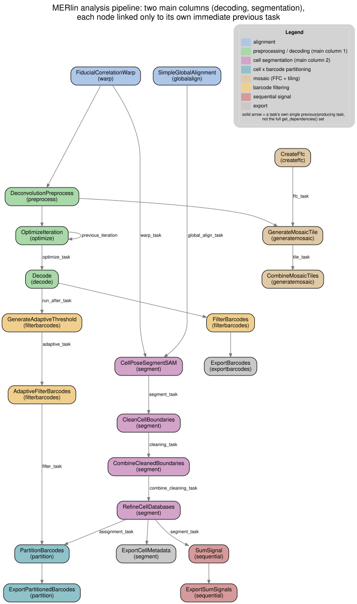

Analysis pipeline
*******************

Each analysis task in an analysis-parameters file (see :doc:`usage`) names the other
tasks it needs through its own parameters (for example ``preprocess_task`` or
``segment_task``); a task's ``get_dependencies()`` method turns those parameter values
into the task names :class:`~merlin.util.snakewriter.SnakefileGenerator` needs to build
the Snakemake workflow. The diagram below renders that dependency graph for one
real, full-pipeline analysis-parameters file -- decoding, adaptive barcode filtering,
CellPose segmentation, barcode partitioning, and smFISH/sequential signal, all in a
single configuration -- as a concrete, worked example of how the task graph fits
together. Individual configurations vary (see :doc:`tasks` for every task's own
parameters), but the dependency shapes shown here -- warp feeding preprocessing and
segmentation, decoding feeding filtering and partitioning, segmentation feeding both
partitioning and sequential signal -- are the ones almost any MERlin pipeline follows.

Two details in the diagram are worth calling out, since they aren't visible from the
analysis-parameters file alone:

* ``LeastSquaresGlobalAlignment`` depends on a ``RegisterFovNeighbors`` task through a
  parameter default (``neighbor_registration_task``), not through anything declared in
  the file itself -- shown dashed. Any analysis-parameters file that uses
  ``LeastSquaresGlobalAlignment`` needs a ``RegisterFovNeighbors`` task available for
  the dataset, whether or not it is listed alongside it.
* The example file's mosaic-generation step uses a task class named ``GenerateMosaic``,
  which has since been replaced in ``merlin/analysis/generatemosaic.py`` by the
  per-fov ``GenerateMosaicTile`` + ``CombineMosaicTiles`` pair (see :doc:`tasks`) --
  also shown dashed, as a legacy node kept only because the source file names it.

The diagram's source (``merlin_pipeline_flow.dot``, next to the rendered SVG in
``docs/_static/``) can be regenerated with Graphviz after edits:
``dot -Tsvg merlin_pipeline_flow.dot -o merlin_pipeline_flow.svg``.
